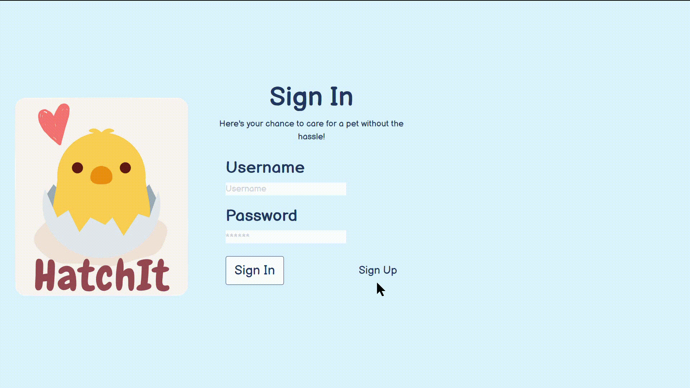
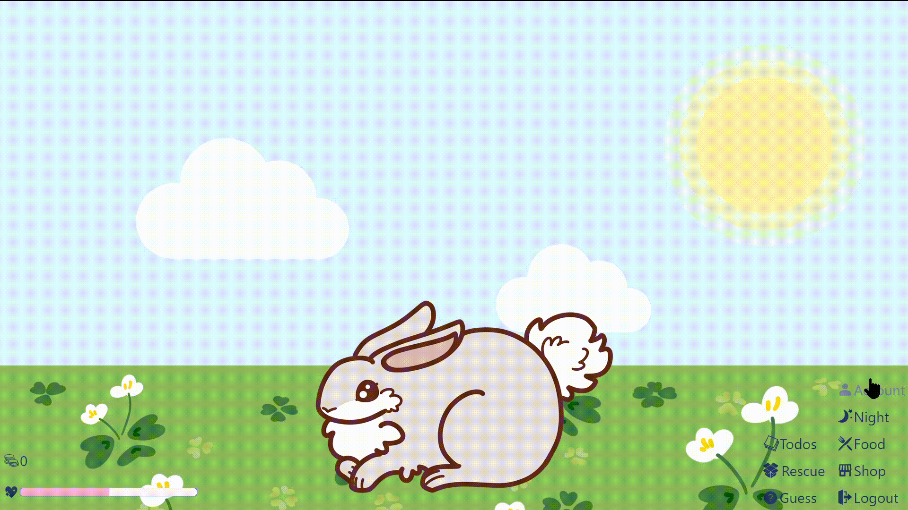
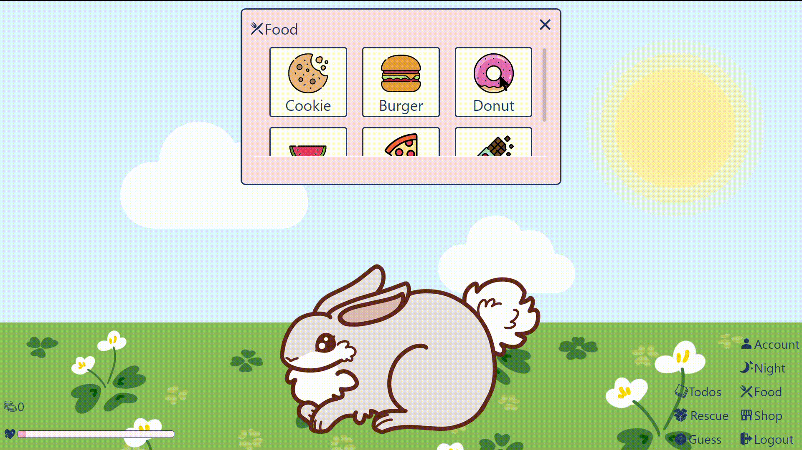
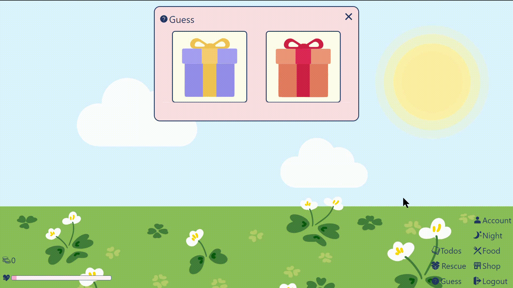
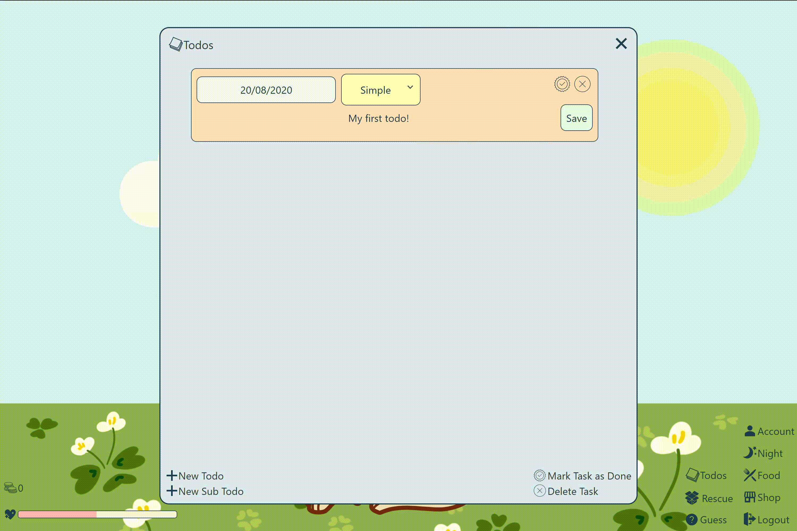
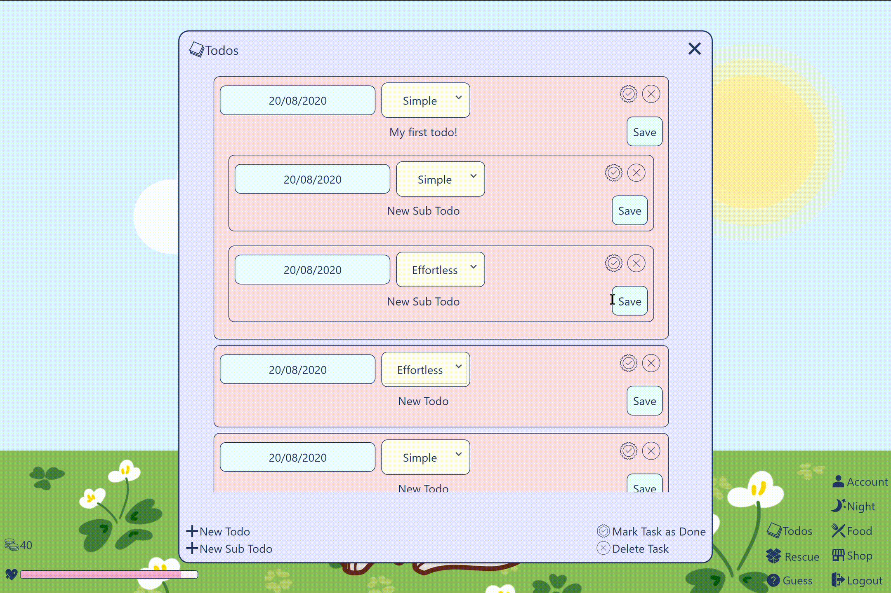
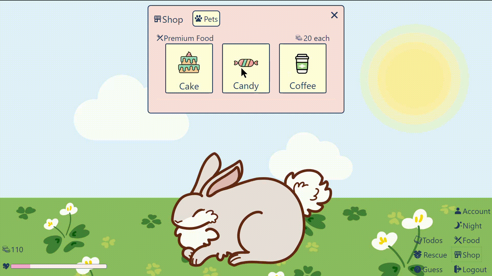
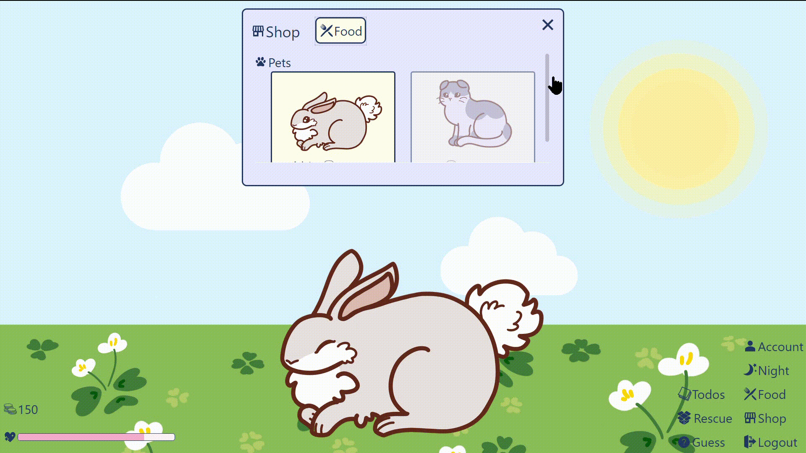

# User Guide

- Table of Contents
  - [Account](#account)
  - [Happiness Level](#happiness-level)
  - [General Pet Interactions](#general-pet-interactions)
  - [To-do List](#to-do-list)
  - [Shop](#shop)
  - [Day and Night Mode](#day-and-night-mode)

## Account

- User is able to create an account with a unique username and password to store the current pet’s data
  
- Keeps track of the user’s statistics
  - Total Happiness level gained overall
    - Once a pet has reached maximum happiness level, a breakdown of events that increased happiness level is shown
  - Amount of todos and sub todos completed
  - Best time of completion for the “Rescue” minigame 
    

The account keeps track of the user’s statistics and achievements, a visualisation of the user’s productivity which can inspire the user to continue completing todos and thus, be productive.

## Happiness Level

- Happiness level decreases over time
- If happiness level is 0, the in-game currency will decrease to 0
- If happiness level is 100, the pet transits to maximum happiness state
- If at least 100 happiness increase is accumulated, and in-game currency increases by 100.
  
  
- Pet Interactivity

  | Happiness Level | Pet State         |
  | --------------- | ----------------- |
  | Zero            | brokenhearted     |
  | Low             | sad               |
  | Normal          | general           |
  | High            | happy             |
  | Maximum         | maximum happiness |

Since the happiness level of the pet is constantly decreasing, the user needs to continuously interact with it or complete todos (which gives more happiness points). This fulfills the app’s aim to be a virtual pet, and to increase productivity. The pet’s appearance will also change with its happiness level, mimicking an actual pet.

## General Pet Interactions

- Petting
  - Pet is normally in a “general” state
  - Pet will do an action(e.g. jump/rollover) and transit into a “reaction” state when the user double clicks
    
- Feeding
  - General food options are displayed (e.g. Cookie, Burger, Chocolate, Donut, Pizza, Watermelon)
  - User can drag their choice of food to the pet, pet transits into a “eating” state
  - Happiness level of pet will increase after feeding
    
- Playing
  - “Guess” minigame (only available once per day)
  - Pet transits into a “questioning” state
  - Two buttons will pop up and the user picks one
  - If the user guessed correctly → either happiness level of pet increases or user gets some coins
  - If the user guessed wrongly → happiness level of pet decreases
    
- “Rescue” minigame (only available once per day)
  - Pet is trapped in a box, pet transits into a panic state
  - Getting pet out of box → aggressive clicking
  - Time limit → if you don’t rescue your pet on time: happiness level of pet decreases
  - Success → increases the pet’s happiness level
    

These personal pet interactions allow for the user to have a stronger connection with the virtual pet, emulating a real pet. This bond can then serve as a strong motivator for the user to be productive to keep their pets happy.

## To-do List

- Create todos and sub todos with descriptions, difficulty levels and deadlines

  - Select a date using a datepicker
  - Edit description by clicking on the description
  - Colour of date of the todo changes colour as the deadline is reaching

    | Colour     | Days to Deadline |
    | ---------- | ---------------- |
    | Light Pink | more than 3 days |
    | Pink       | 0 to 3 days      |
    | Dark Pink  | less than 0 days |

- Difficulty levels range from 1 to 5, and the default difficulty level is 2

  |     | Difficulty Level |
  | --- | ---------------- |
  | 1   | Effortless       |
  | 2   | Simple           |
  | 3   | Medium           |
  | 4   | Troublesome      |
  | 5   | Difficult        |

  

- Able to rearrange todos and sub todos by dragging them around
  - User can rearrange todos
  - User can rearrange sub todos within the todo
  - User can move a sub todo to another todo
    
- Todo can be marked as completed or deleted

  - Todo is removed after completion or deletion
  - Complete a todo → pet transits into a “productive” state, happiness level and in-game currency increases depending on the difficulty level of todo
    

This is the main productivity feature of our app, which the user can use to organise their life and monitor their own productivity. The satisfaction of crossing out a completed todo compounded with the happiness and currency reward will help to further motivate the user to be productive.

## Shop

- In-game currency can be used to purchase items from the shop
- Purchase premium food from the fridge
  - Favourite food → gets happier compared to other foods
  
- Ability to purchase a new pet type
  - Stores the current pet information and replaces the current pet
  - Previously unlocked pet types will be free to use
  

This feature appeals to the user’s desire to collect all the cute pets in the game, which will motivate the user to complete more todos to earn in-game currency. Furthermore, in order to unlock a new pet type, the user has to first reach maximum happiness with their current pet. This ensures that the user will properly take care of their virtual pet and be productive.

## Day and Night Mode

- Lights on and off → control user’s screen time
- Pet transits into a “sleeping” state during Night mode and certain features are unaccessible
  - To-do list is still available for use, happiness level will not increase after a task is completed, only coins will increase
- Happiness level will remain the same during Night mode
  

When life gets too hectic, taking care of the pet may overwhelm the user. Therefore, this feature allows the user to take a break before coming back to their pet. The to-do list feature will still be available during Night mode, so the user’s productivity will not be compromised.
